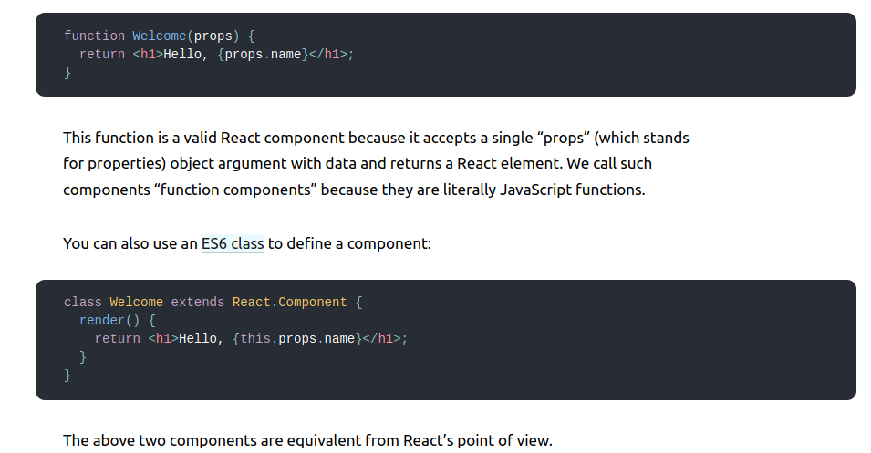

### Pomocne linki przy instalacji narzędzi

- [instalacja NodeJS](https://aimweb.pl/jak-zainstalowac-nodejs-i-npm/),
- sprawdzenie poprawności instalacji za pomocą komend `node -v` i `npm -v`,
- [instalacja 'create-react-app'](https://pl.reactjs.org/docs/create-a-new-react-app.html#create-react-app), na stronie są również inne 'zestawy narzędziowe', np. [Gatsby](https://pl.reactjs.org/docs/create-a-new-react-app.html#gatsby),
- najświeższa wersja [dokumentacji 'create-react-app'](https://github.com/facebook/create-react-app/blob/master/packages/cra-template/template/README.md),

### Porady i informacje

- do pliku .gitignore dobrze jest dodać linię `node_modules/`, żeby nie wysyłacć na repo niepotrzebnych plików o sporej wadze,
- w gałęzi [main] naszego repozytorium znajduje się wersja końcowa aplikacji, poszczególne etapy budowy aplikacji znajdują się w gałęziach postaci `cra/numer_zagadnienia - nazwa_zagadnienia`, np. [tutaj](https://github.com/zacniewski/materials-about-internet-apps-and-www-websites/tree/cra/01-HelloWorld/React-pierwsze-kroki)

### Dokumentacja

- główne [koncepcje](https://reactjs.org/docs/hello-world.html) w React.js,
- praca z narzędziem [create-react-app](https://create-react-app.dev/docs/getting-started),
- co nowego w [ES6](https://www.w3schools.com/js/js_es6.asp),
- podstawowe [pojęcia](https://pl.reactjs.org/docs/glossary.html) w React.

### Zagadnienia

1. instalacja pakietu create-react-app
   

2. tworzenie aplikacji za pomocą create-react-app
   


    * celem aplikacji będzie wyświetlanie najważniejszych wydarzeń dotyczących naszego dnia (pracy, nauki, itp.).

3. struktura projektu
   


    - index.js jako plik "wejściowy" (import modułów i komponentów)
    - App.js zawiera komponent ```App``` i importuje CSSy z pliku ```App.css```  i może zawierać importy niezbędnych mu modułów i plików,
    - osobne plik .js i .css do komponentów.

4. [JSX](https://reactjs.org/docs/introducing-jsx.html) - kod HTML wewnątrz JavaScript


    - przykład:

 - użycie fukcji i obiektów JS przed tworzeniem komponentów  
  - błąd w składni natychmiast jest wyświetlany zarówno w konsoli jak i w przeglądarce

5. komponenty w React.js


    - komponenty funkcyjne i komponenty klasowe: [przykład z dokumentacji](https://reactjs.org/docs/components-and-props.html),
    
    - własny komponent Hello (plik Hello.jsx) w gałęzi [01](https://github.com/zacniewski/materials-about-internet-apps-and-www-websites/tree/cra/01-HelloWorld/React-pierwsze-kroki) i sprawdzenie poprawności działania (```npm start```).

6. upraszczanie projektu, czyli usunięcie zbędnych plików (gałąź [02](https://github.com/zacniewski/materials-about-internet-apps-and-www-websites/tree/cra/02-czyszczenie-projektu/React-pierwsze-kroki))

7. Komponent Countdown
    - zwracamy tylko jeden element HTML! (sprawdzić co będzie, gdy zwracamy wiecej)
    - 'App' jako konwencja nazewnicza (zamiast 'Hello') w gałęzi [03](https://github.com/zacniewski/materials-about-internet-apps-and-www-websites/tree/cra/03-komponenty-i-props/React-pierwsze-kroki/react-pierwsze-kroki/src),
    - class vs className w przypadku atrybutów, czyli [różnice](https://pl.reactjs.org/docs/dom-elements.html) w atrybutach HTML i React DOM,

8. zagnieżdżanie komponentów (gałąź nr [04](https://github.com/zacniewski/materials-about-internet-apps-and-www-websites/tree/cra/04-zagniezdzanie-komponentow/React-pierwsze-kroki/react-pierwsze-kroki/src))


    - nowy plik Countdown.jsx z komponentem + import w pliku App.js
    - nowy plik Countdown2.jsx z komponentem + import w pliku App.js
    - teraz komponenty wyświetlają statyczną informację, jak to zmienić?

9. Props (właściwości, w gałęzi nr [05](https://github.com/zacniewski/materials-about-internet-apps-and-www-websites/tree/cra/05-props/React-pierwsze-kroki/react-pierwsze-kroki/src))


    - props (od ang. properties = pol. właściwości) są danymi wejściowymi dla reactowych komponentów. Przekazuje się je z komponentów nadrzędnych do ich potomków. Właściwości props są tylko do odczytu. Nie należy ich w jakikolwiek sposób modyfikować,

10. PropTypes


    - gwarancja odpowiedniego typu danych w gałęzi nr [06](https://github.com/zacniewski/materials-about-internet-apps-and-www-websites/tree/cra/06-proptypes/React-pierwsze-kroki),
    - dla niewłaściwego typu otrzymujemy ostrzeżenie:


11. State (stan) w gałęzi [07](https://github.com/zacniewski/materials-about-internet-apps-and-www-websites/tree/cra/07-state/React-pierwsze-kroki)


    - komponent potrzebuje własnego stanu (state), gdy powiązane z nim dane zmieniają się w czasie. Na przykład, komponent Checkbox w zmiennej isChecked mógłby śledzić, czy jest zaznaczony, a komponent NewsFeed mógłby przechowywać pobrane posty w fetchedPosts,
    - najistotniejszą różnicą pomiędzy state i props jest to, że właściwości props są dostarczane przez komponent nadrzędny, a stanem state zarządza sam komponent. Komponent nie może modyfikować swoich właściwości props, ale może zmieniać swój stan state,
    - zamiast funkcji musimy użyć klasy dziedziczącej z klasy Component,
    - w state zapisujemy te elementy, które będą się zmieniać w czasie "pracy" aplikacji, w naszym przypadku możemy utworzyć odpowiednie struktury danych,
    - tworzymy konstruktor i wywołujemy metodę super(), w celu udostępniania i korzystania z funkcji klasy po której nasz obiekt dziedziczy.

12. Generowanie komponentów w gałęzi [08](https://github.com/zacniewski/materials-about-internet-apps-and-www-websites/tree/cra/08-generowanie-komponentow/React-pierwsze-kroki)


    - używamy funkcji [map()](https://www.w3schools.com/jsref/jsref_map.asp) do iteracji po wszystkich elementach struktury danych w state, tym samym możemy wygenerować odpowiednią liczbę komponentów,
    - możemy otrzymać ostrzeżenie w konsoli:
    
    - wirtualny DOM renderuje tylko zmiany, które powstały w czasie działania aplikacji,
    - każdy komponent musi mieć unikalne 'id', stąd ww. warning i konieczność dopisania właściwości 'key'.

12. React Dev Tools


    - rozszerzenie do przeglądarki,
    - w konsoli mamy nowe zakładki: "Components" i "Profiler".

13. CSS


    - CSS dla komponentów i CSS główny w gałęzi [09](https://github.com/zacniewski/materials-about-internet-apps-and-www-websites/tree/cra/09-css/React-pierwsze-kroki)

14. Komponent edycji wydarzenia w gałęzi [10]


    - komponenty React'owe można wykorzystywać z [Material-UI](https://material-ui.com/),
    - [obsługa](https://upmostly.com/tutorials/react-onchange-events-with-examples) zmiany wartości input'a w React (onchange w JS, onChange w React),
    - właściwość zdarzenie ['target'](https://www.w3schools.com/jsref/event_target.asp)
    - [obsługa zdarzeń](https://pl.reactjs.org/docs/handling-events.html) w React,
