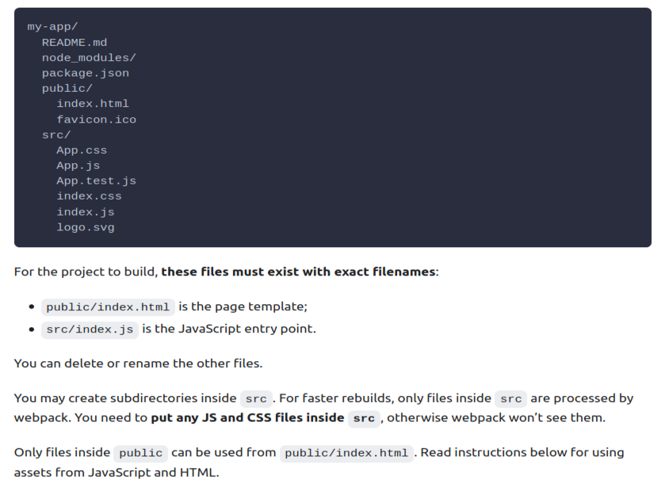

### Pomocne linki przy instalacji narzędzi
  * [instalacja NodeJS](https://aimweb.pl/jak-zainstalowac-nodejs-i-npm/),
  * sprawdzenie poprawności instalacji za pomocą komend ```node -v``` i ```npm -v```,
  * [instalacja 'create-react-app'](https://pl.reactjs.org/docs/create-a-new-react-app.html#create-react-app), na stronie są również inne 'zestawy narzędziowe', np. [Gatsby](https://pl.reactjs.org/docs/create-a-new-react-app.html#gatsby),  
  * najświeższa wersja [dokumentacji 'create-react-app'](https://github.com/facebook/create-react-app/blob/master/packages/cra-template/template/README.md),  

### Porady i informacje
  * do pliku .gitignore dobrze jest dodać linię ```node_modules/```, żeby nie wysyłacć na repo niepotrzebnych plików o sporej wadze,
  * w gałęzi [main] naszego repozytorium znajduje się wersja końcowa aplikacji, poszczególne etapy budowy aplikacji znajdują się w gałęziach postaci ```cra/numer_zagadnienia - nazwa_zagadnienia```, np. [tutaj](https://github.com/zacniewski/materials-about-internet-apps-and-www-websites/tree/cra/01-HelloWorld/React-pierwsze-kroki)


### Dokumentacja
  * główne [koncepcje](https://reactjs.org/docs/hello-world.html) w React.js,
  * praca z narzędziem [create-react-app](https://create-react-app.dev/docs/getting-started),
  * co nowego w [ES6](https://www.w3schools.com/js/js_es6.asp).

### Zagadnienia
  1. instalacja pakietu create-react-app
    
  2. tworzenie aplikacji za pomocą create-react-app
    
    * celem aplikacji będzie wyświetlanie najważniejszych wydarzeń dotyczących naszego dnia (pracy, nauki, itp.),
  3. struktura projektu
    
    - index.js jako plik "wejściowy" (import modułów i komponentów)
    - App.js zawiera komponent ```App``` i importuje CSSy z pliku ```App.css```  i może zawierać importy niezbędnych mu modułów i plików,
    - osobne plik .js i .css do komponentów.
  4. [JSX](https://reactjs.org/docs/introducing-jsx.html) - kod HTML wewnątrz JavaScript
    - przykład:  
  
    - użycie fukcji i obiektów JS przed tworzeniem komponentów  
  
    - błąd w składni natychmiast jest wyświetlany zarówno w konsoli jak i w przeglądarce
  5. komponenty w React.js
    - komponenty funkcyjne i komponenty klasowe: [prykład z dokumentacji](https://reactjs.org/docs/components-and-props.html),
    - własny komponent Hello (plik Hello.jsx) w gałęzi [01](https://github.com/zacniewski/materials-about-internet-apps-and-www-websites/tree/cra/01-HelloWorld/React-pierwsze-kroki) i sprawdzenie poprawności działania (```npm start```),
  6. upraszczanie projektu, czyli usunięcie zbędnych plików (gałąź [02](https://github.com/zacniewski/materials-about-internet-apps-and-www-websites/tree/cra/02-czyszczenie-projektu/React-pierwsze-kroki))

  7. Komponent Countdown
    - zwracamy tylko jeden element HTML! (sprawdzić co będzie, gdy zwracamy wiecej)
    - 'App' jako konwencja nazewnicza (zamiast 'Hello')
    - class vs className w przypadku atrybutów, czyli [różnice](https://pl.reactjs.org/docs/dom-elements.html) w atrybutach HTML i React DOM,

  8. zagnieżdżanie komponentów
    - nowy plik Countdown.jsx z komponentem + import w pliku App.js
    - nowy plik Countdown2.jsx z komponentem + import w pliku App.js
    - teraz komponenty wyświetlają statyczną informację, jak to zmienić?

    

